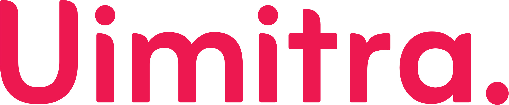

# 🖥️ UI Mitra

✨ **UI Meets Trust | UX Meets Mitra**



## 📌 Overview

UI Mitra is a cutting-edge digital agency that combines artificial intelligence with human creativity to deliver exceptional design and marketing solutions. Our platform showcases our comprehensive range of services through an immersive, interactive experience built with modern web technologies.

## 🎯 Purpose & Vision

Our mission is to bridge the gap between technology and creativity, delivering solutions that not only look beautiful but drive real business results. We envision a future where AI enhances human creativity rather than replacing it, enabling faster, more data-driven design and marketing decisions.

## 👥 Target Audience

- **Startups & Scale-ups**
  - Tech companies needing modern, scalable design
  - Growth-focused businesses requiring marketing expertise
  - Innovation-driven enterprises seeking AI solutions

- **Established Businesses**
  - Companies undergoing digital transformation
  - Brands looking to refresh their digital presence
  - Organizations expanding their market reach

- **Creative Agencies**
  - Design firms seeking AI enhancement
  - Marketing agencies needing technical expertise
  - Digital consultancies wanting collaboration

## 🛠️ Services We Offer

### UI/UX & Graphics
- **Professional UI/UX Design**
  - User Interface Design
  - Experience Optimization
  - Wireframing & Prototyping
  - Usability Testing

- **AI-Enhanced Design**
  - Smart Layout Generation
  - Automated Design Testing
  - Performance Analytics
  - Dynamic Adaptations

- **Graphics & Motion**
  - Brand Identity Design
  - Motion Graphics
  - Digital Illustrations
  - Marketing Collateral

### Digital Marketing
- **Social Media Marketing**
  - Twitter Growth Strategy
  - LinkedIn Business Solutions
  - Instagram Marketing
  - Emerging Platforms

- **SEO & Content**
  - Search Engine Optimization
  - Content Strategy
  - Analytics & Reporting
  - Performance Tracking

## 🧩 Unique Features

### Modern Architecture
- Component-based design
- SEO-optimized structure
- Responsive layouts
- Performance-focused

### Interactive Elements
- Dynamic animations
- AI demonstrations
- Real-time previews
- Interactive portfolios

### User Experience
- Intuitive navigation
- Fast load times
- Accessible design
- Mobile-first approach

## 💡 What Makes UI Mitra Different

1. **AI Integration**
   - AI-powered design suggestions
   - Automated testing and optimization
   - Data-driven decision making
   - Smart content recommendations

2. **Holistic Approach**
   - End-to-end service integration
   - Cross-platform consistency
   - Brand-focused solutions
   - Scalable frameworks

3. **Innovation Focus**
   - Emerging technology adoption
   - Continuous improvement
   - Research-based solutions
   - Future-proof designs

## ⚙️ Technologies We Use

### Frontend Development
- React 18 with TypeScript
- Tailwind CSS & CSS Modules
- Framer Motion
- React Helmet Async

### Design Tools
- Figma
- Adobe Creative Suite
- Sketch
- Motion Design Software

### Marketing Tools
- Analytics Platforms
- SEO Tools
- Social Media Management
- Content Management Systems

## 🚀 User Journey

1. **Discovery**
   - Browse services
   - Explore case studies
   - View technology stack

2. **Engagement**
   - Interactive demonstrations
   - Service exploration
   - Portfolio review

3. **Connection**
   - Schedule consultation
   - Direct contact
   - Partnership discussion

## 📈 Business Impact

### For Clients
- Reduced design time by 40%
- Increased conversion rates
- Improved user engagement
- Better ROI on digital investments

### For Partners
- Access to cutting-edge technology
- Collaborative opportunities
- Shared resource benefits
- Market expansion

## 🔐 Privacy & Security

- GDPR Compliance
- Data Protection
- Secure Communication
- Privacy-First Approach

## 🤝 Collaboration Opportunities

### For Businesses
- Strategic partnerships
- Joint ventures
- Technology sharing
- Market collaboration

### For Developers
- Open source contributions
- Technology integration
- Innovation projects
- Research collaboration

## 📩 Contact & Connect

### Direct Contact
- Website: [https://uimitra.com](https://uimitra.com)
- Schedule Meeting: [Book Now](https://outlook.office.com/book/MeetwithTeamUimitra@yatricloud.com/)

### Social Media
- LinkedIn: [UI Mitra](https://linkedin.com/company/uimitra)
- Twitter: [@UIMitra](https://twitter.com/uimitra)
- Instagram: [@ui.mitra](https://instagram.com/ui.mitra)

## Technical Documentation

### Installation
```bash
git clone [repository-url]
cd uimitra
npm install
npm run dev
```

### Project Structure
```
uimitra/
├── src/
│   ├── components/
│   │   ├── Services/
│   │   │   ├── Marketing/      # Marketing components
│   │   │   ├── UIUXGraphics/   # Design components
│   │   │   └── Brand/          # Brand components
│   │   ├── Technology/         # Tech stack
│   │   ├── Common/             # Shared components
│   │   └── AnimatedText.tsx    # Animations
│   ├── assets/                 # Static files
│   ├── styles/                 # Global styles
│   ├── App.tsx                 # Main app
│   └── main.tsx               # Entry
├── public/                    # Public assets
└── package.json              # Dependencies
```

### Configuration
```env
VITE_APP_TITLE=Uimitra
VITE_APP_DESCRIPTION=Digital Marketing & Design Agency
VITE_APP_URL=https://uimitra.com
```

### Design System
- Primary: #ED184F
- Secondary: #F05A28
- Dark: #1F2937
- Light: #F9FAFB

## License & Credits

This project is licensed under the MIT License.

### Acknowledgments
- [React](https://react.dev)
- [Tailwind CSS](https://tailwindcss.com)
- [Framer Motion](https://www.framer.com/motion)
- [React Helmet Async](https://github.com/staylor/react-helmet-async)
- [Lucide Icons](https://lucide.dev)
- [TypeScript](https://www.typescriptlang.org)
- [Vite](https://vitejs.dev) 